# Avestan OCR Training and Application – Kraken + eScriptorium

This folder contains the full training and application pipeline for Avestan OCR using [Kraken](https://github.com/mittagessen/kraken) and [eScriptorium](https://gitlab.com/scripta/escriptorium). It handles image segmentation, recognition model training, and output generation using ALTO XML. Outputs are later converted to CAB-compatible XML formats using tools from the `xml_translator/` module.

---

## 📁 Folder Structure

```
Applying_OCR/
├── Makefile                  # Defines all Kraken training and evaluation targets
├── models/                  # Stores trained segmentation and recognition models
│   ├── segmentation/
│   └── recognition/
```

---

## 🧭 Workflow Overview

```mermaid
graph LR
    subgraph "Image & Transcription Preparation"
        manuscript_images["Avestan Manuscript Images"]
        transcription_xml["Transcription in ALTO XML<br/>(from CAB or manually corrected OCR)"]
        segmented_data["Segmented Line/Word Regions"]
        labeled_training_data["Aligned Image–Text Pairs"]

        manuscript_images -->|Segmentation GUI<br/>eScriptorium| segmented_data
        segmented_data -->|Manually aligned<br/>or copy-pasted text| labeled_training_data
        transcription_xml -->|Aligned via GUI| labeled_training_data
    end

    subgraph "Model Training (Kraken)"
        training_config["Makefile Config"]
        recognition_model["Recognition Model (.mlmodel)"]
        segmentation_model["Segmentation Model (.mlmodel)"]

        labeled_training_data -->|Training Step 1| segmentation_model
        labeled_training_data -->|Training Step 2| recognition_model
        training_config -->|Makefile targets| recognition_model
        training_config -->|Makefile targets| segmentation_model
    end

    subgraph "Inference (OCR Application)"
        new_images["New Unseen Manuscript Images"]
        predicted_xml["Predicted ALTO XML<br/>(via eScriptorium or CLI)"]

        new_images -->|Apply segmentation_model| segmented_data_new
        segmented_data_new -->|Apply recognition_model| predicted_xml
    end

    subgraph "Post-OCR Processing"
        predicted_xml -->|xml_translator.py| cab_format_output["CAB XML Format Output"]
    end
```



---

## 🛠 Makefile Targets

The `Makefile` defines the Kraken training and evaluation pipeline. Example targets include:

```makefile
train_seg:
	kraken train -i data/segmentation/*.xml -o models/segmentation/model.mlmodel

train_recog:
	kraken train -i data/recognition/*.xml -o models/recognition/model.mlmodel

eval:
	kraken eval -m models/recognition/model.mlmodel -i test/*.xml
```

Use `make train_seg`, `make train_recog`, or define your own targets for batch training/evaluation.

---

## 🧪 Input/Output Formats

### Input:
- Line-segmented manuscript images (from eScriptorium or Kraken segmenter)
- ALTO XML files with gold-standard transcriptions

### Output:
- `.mlmodel` files (segmentation + recognition)
- ALTO XML predictions from Kraken
- CAB-format XML via `xml_translator/`

---

## 🧩 Dependencies

This pipeline assumes you have:
- Kraken installed (`pip install kraken`)
- eScriptorium for GUI-assisted segmentation/transcription
- Pre-cleaned ALTO XML exported from eScriptorium

---

## 📬 Contact

For setup or usage help, contact the repository maintainer at [your GitHub/email].