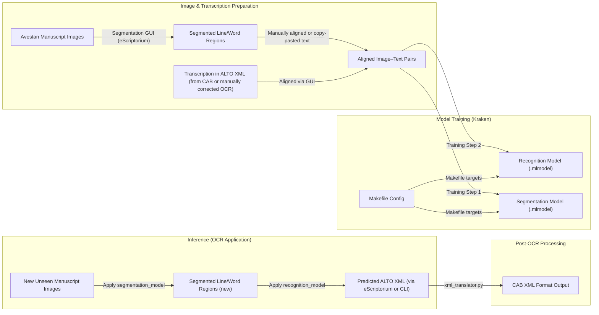

# Avestan OCR Training and Application – Kraken + eScriptorium

# Avestan OCR Training and Application – Kraken + eScriptorium

 Pretrained OCR models are available on [Hugging Face](https://huggingface.co/Nikyek/avestan-ocr-kraken-v1).


This folder contains the full training and application pipeline for Avestan OCR using [Kraken](https://github.com/mittagessen/kraken) and [eScriptorium](https://gitlab.com/scripta/escriptorium). It handles image segmentation, recognition model training, and output generation using ALTO XML. Outputs are later converted to CAB-compatible XML formats using tools from the `xml_translator/` module.

---

##  Folder Structure

```
Applying_OCR/
├── Makefile                  # Defines all Kraken training and evaluation targets
├── models/                  # Stores trained segmentation and recognition models
│   ├── segmentation/
│   └── recognition/
```

---

## Workflow Overview


---

##  Makefile Targets

The `Makefile` defines the Kraken training and evaluation pipeline. Example targets include:


Use `make train_seg`, `make train_recog`, or define your own targets for batch training/evaluation.

---

##  Input/Output Formats

### Input:
- Line-segmented manuscript images (from eScriptorium or Kraken segmenter)
- ALTO XML files with gold-standard transcriptions

### Output:
- `.mlmodel` files (segmentation + recognition)
- ALTO XML predictions from Kraken
- CAB-format XML via `xml_translator/`

---

##  Dependencies

This pipeline assumes you have:
- Kraken installed (`pip install kraken`)
- eScriptorium for GUI-assisted segmentation/transcription
- Pre-cleaned ALTO XML exported from eScriptorium