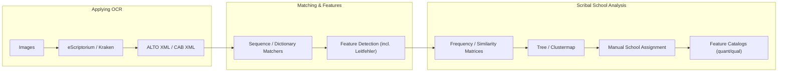

# Avestan OCR & Scribal Analysis

Tools for **Avestan manuscript processing**: OCR (Kraken + eScriptorium), token matching, feature/Leitfehler analysis, and **scribal-school** exploration.

**Model card:** [avestan-ocr-kraken-v1](https://huggingface.co/Nikyek/avestan-ocr-kraken-v1)

---

## Overview

This repository is a modular toolkit that:

1. Applies OCR to manuscript images (segmentation + recognition).
2. Aligns OCR or manually transliterated text to a **canonical** reference.
3. Detects grapheme-level changes (substitutions / insertions / deletions; Leitfehler).
4. Aggregates features across manuscripts to compute similarity, cluster manuscripts, and support **manual** scribal-school assignment.
5. Produces quantitative & qualitative feature catalogs.

### End-to-End at a Glance

