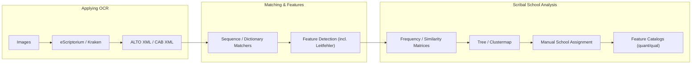

# Avestan OCR & Scribal Analysis

> Tools for **Avestan manuscript processing**: OCR (Kraken + eScriptorium), token matching, feature/Leitfehler analysis, and **scribal-school** exploration.
> Model card: **[avestan-ocr-kraken-v1](https://huggingface.co/Nikyek/avestan-ocr-kraken-v1)**, 
**CAB website: https://cab.geschkult.fu-berlin.de/**
---

## Overview

This repository is a modular toolkit that:

1. Applies OCR to manuscript images (segmentation + recognition).
2. Aligns OCR or manually transliterated text to a **canonical** reference.
3. Detects grapheme-level changes (substitutions / insertions / deletions; Leitfehler).
4. Aggregates features across manuscripts to support similarity, clustering, and **manual** scribal-school assignment.
5. Produces quantitative & qualitative feature catalogs.

### End-to-End at a Glance




> On Hugging Face, Mermaid doesn’t render—embed a PNG/SVG or link back here.

---

## Repository Structure

```
applying_ocr/                # OCR workflow (eScriptorium/Kraken), models, Makefile
src/
  image_processing/          # image helpers
  interfaces/                # I/O adapters (CAB, ALTO, translators)
  matchers/
    dictionary_matcher/      # lexicon/rule-aware token matcher
    sequence_matcher/        # DP alignment (handles merges/splits)
    spellchecker_test/       # experimental baseline (candidate suggestions)
  leitfehler/                # additions/omissions/permutations/substitutions
  scribal_school_analysis/   # frequency/similarity, clustering, catalogs
  utils/                     # shared helpers
```

### Jump to module READMEs

* OCR: **`applying_ocr/README.md`**
* Matchers: **`src/matchers/README.md`**
* Scribal schools (Overview & steps): **`src/scribal_school_analysis/README.md#overview`**
* Leitfehler: **`src/leitfehler/README.md`** (if present)
* Spell checker (experimental): **`src/matchers/spellchecker_test/README.md`**

---

## Installation

```bash
# Python >= 3.10
# Clone and enter the repo, then:
poetry install             # or: pip install -e .
poetry run python -m pip --version
```

> The OCR model + training notes live in `applying_ocr/` and on the HF card:
> **[https://huggingface.co/Nikyek/avestan-ocr-kraken-v1](https://huggingface.co/Nikyek/avestan-ocr-kraken-v1)**

---

## Quick Start Examples

**1) OCR to tokens**
Use `applying_ocr/` to produce ALTO/CAB XML (via eScriptorium/Kraken).

**2) Align tokens (pick a matcher)**

```bash
# Sequence matcher (robust across merges/splits)
poetry run python src/matchers/sequence_matcher/matcher.py --help

# Dictionary matcher (precise "x for y" tags + candidates)
poetry run python src/matchers/dictionary_matcher/matcher.py --help
```

**3) Build features / matrices / catalogs**

```bash
# From matched pairs to features & matrices
poetry run python src/scribal_school_analysis/03_create_frequency_matrix.py --help
poetry run python src/scribal_school_analysis/04_create_similarity_matrix.py --help

# Propose catalogs after manual school assignment
poetry run python src/scribal_school_analysis/05_propose_feature_catalog.py --help
```

---

## Notes & Limitations

* Normalize **Unicode** consistently (NFC/NFD); combining marks affect edit distance.
* Use **per-tradition** configs (normalization + substitution rules) to avoid
  labeling legitimate orthographic/phonological variants as “errors.”
* Clustering and similarity are **advisory**; **scribal-school assignment is manual**, guided by philology.
* `spellchecker_test/` is experimental—good for candidate generation, not for unattended correction.

