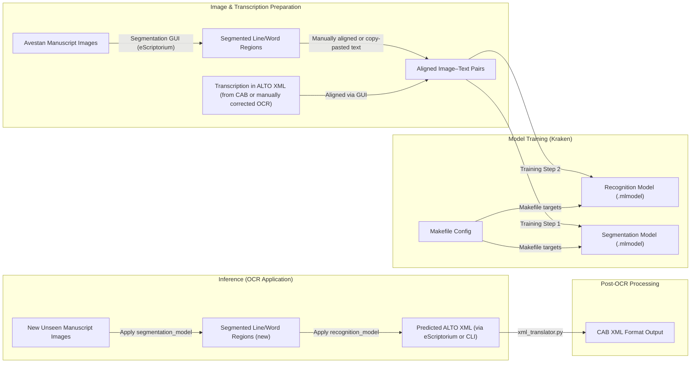

```mermaid
graph LR

  %% Invisible class for padding nodes
  classDef invisible fill:transparent,stroke:transparent,opacity:0;

  %% -------- Image & Transcription --------
  subgraph "Image & Transcription Preparation"
    pad1[" "]:::invisible
    manuscript_images["Avestan Manuscript Images"]
    transcription_xml["Transcription in ALTO XML (from CAB or manually corrected OCR)"]
    segmented_data["Segmented Line/Word Regions"]
    labeled_training_data["Aligned Image–Text Pairs"]

    manuscript_images -->|"Segmentation GUI (eScriptorium)"| segmented_data
    segmented_data -->|"Manually aligned or copy-pasted text"| labeled_training_data
    transcription_xml -->|"Aligned via GUI"| labeled_training_data
  end

  %% -------- Model Training --------
  subgraph "Model Training (Kraken)"
    pad2[" "]:::invisible
    training_config["Makefile Config"]
    recognition_model["Recognition Model (.mlmodel)"]
    segmentation_model["Segmentation Model (.mlmodel)"]

    labeled_training_data -->|"Training Step 1"| segmentation_model
    labeled_training_data -->|"Training Step 2"| recognition_model
    training_config -->|"Makefile targets"| recognition_model
    training_config -->|"Makefile targets"| segmentation_model
  end

  %% -------- Inference --------
  subgraph "Inference (OCR Application)"
    pad3[" "]:::invisible
    new_images["New Unseen Manuscript Images"]
    segmented_data_new["Segmented Line/Word Regions (new)"]
    predicted_xml["Predicted ALTO XML (via eScriptorium or CLI)"]

    new_images -->|"Apply segmentation_model"| segmented_data_new
    segmented_data_new -->|"Apply recognition_model"| predicted_xml
  end

  %% -------- Post-OCR --------
  subgraph "Post-OCR Processing"
    pad4[" "]:::invisible
    cab_format_output["CAB XML Format Output"]
    predicted_xml -->|"xml_translator.py"| cab_format_output
  end


```
