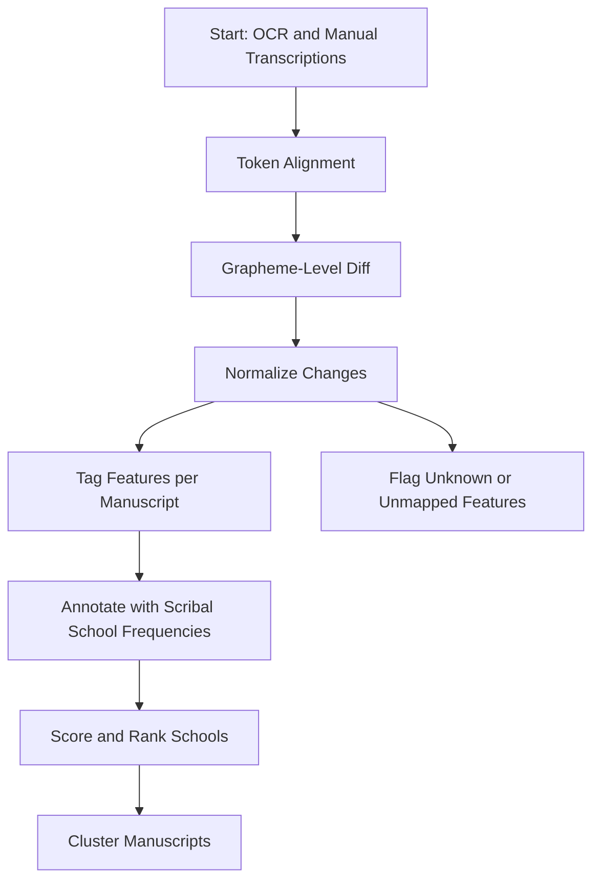

# Feature Analyzer

This project is a computational philology pipeline designed to analyze orthographic and phonological variation across Avestan manuscripts by aligning OCR-transcribed text with a canonical reference and extracting grapheme-level differences. Each detected change (e.g., substitutions, insertions) is normalized into a standardized feature label using a curated mapping, then tagged per manuscript to build a frequency profile of linguistic variants. These features are compared against a feature catalog derived from philological literature, which encodes the typicality of each feature across known scribal schools (e.g., Yazdi, Kermani, Bombay). By aggregating and statistically analyzing these profiles, the system infers the most likely scribal tradition for each manuscript, supporting both quantitative clustering and traditional philological interpretation. The modular pipeline—from alignment to school attribution—enables reproducible, scalable, and linguistically grounded analysis of textual transmission.

