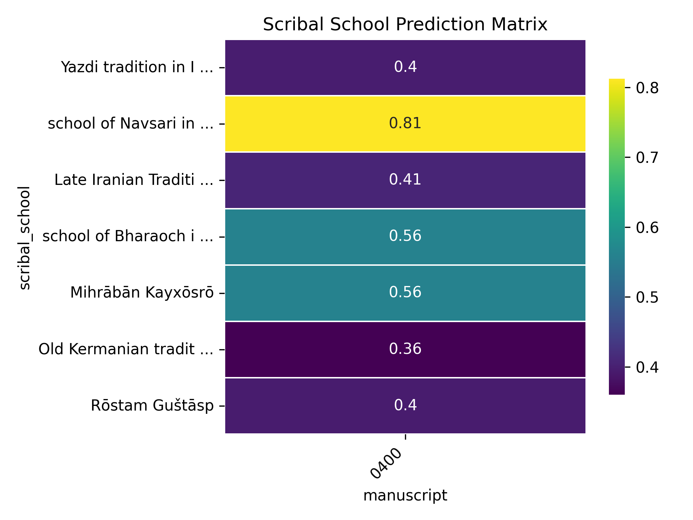
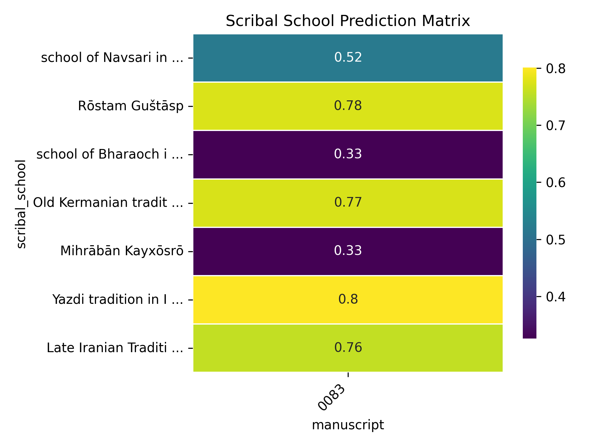
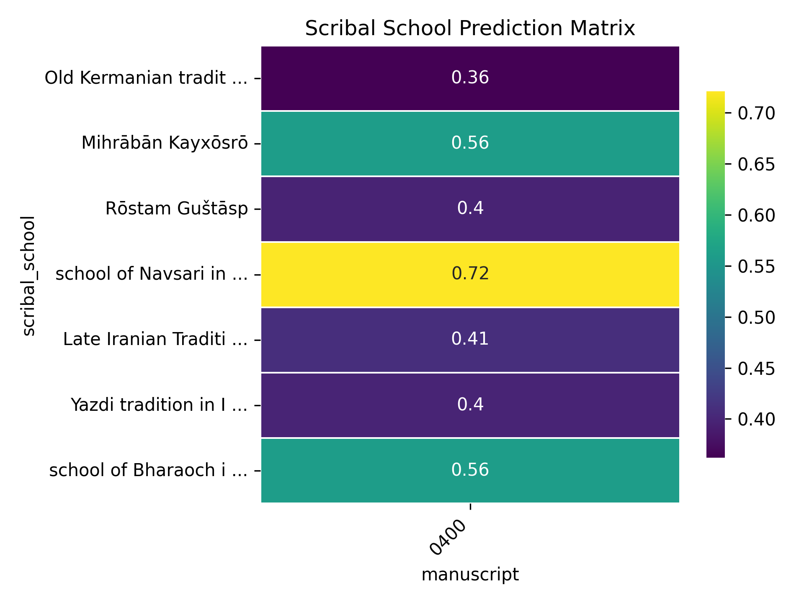

# Scribal School Prediction Project

Currently, to find out the scribal schools of a new manuscript, we have to go through a lengthy process that is roughly outlined in the following steps:

1. **Transliteration**: The manuscript is transliterated, which involves taking pictures of the manuscript pages and transliterating the pictures into a text format.
2. **Token Matching**: The transliterated text is matched, token by token, against a reference text to find the canonical form of each token.
3. **Change Detection**: For each token, given its canonical form, the orthography and phonology differences between the transliterated and the reference tokens are listed. These differences represent orthographic and phonological features of this manuscript.
4. **Manuscript Feature Profile Creation**: Given the orthographic and phonological features of all the tokens in the manuscript, a feature profile for the manuscript is created, which represents the frequency of each feature in the manuscript.
5. **Feature Catalog Compilation**: Based on the previous researches on scribal schools, a feature catalog is compiled, which describes the relation between features and the scribal schools. More precisely, it says how frequent each feature is in each scribal school. It's mostly qualitative.
6. **Scribal School Prediction**: Based on the feature profile of the manuscript and the feature catalog, the scribal school of the manuscript is predicted (using some heuristic analysis and rules-of-thumb).

Currently, the entire process is done manually by researchers, which is significantly time-consuming and error-prone. This project aims to automate the process, making it more efficient and reliable.

This project produces the following outputs:
- **Automation**: Python scripts that automate the steps outlined above.
- **Manuscript Feature Profile**: The orthographic and phonological feature profile of all the manuscripts.
- **Manuscript Similarity Matrix**: A matrix that shows the similarity between manuscripts based on their feature profiles.
- **Scribal School Feature Catalog**: A catalog of orthographic and phonological features of scribal schools.
- **Scribal School Similarity Matrix**: A matrix that shows the similarity between scribal schools based on their feature profiles.
- **Scribal School Prediction Score**: A matrix that shows the affinity of each manuscript with each scribal school based on their feature profiles.

This project only includes a limited number of manuscripts and scribal schools, but it can be extended to include more using the automation scripts. For any new manuscript, the automation in this  updates all the above outputs, making it easy to analyse its features, similarity with other manuscripts, and ultimately find the scribal schools of the manuscript.

## Methodology
The methodology uses a Machine Learning algorithm that splits into three pipelines:
- **Manuscript Analysis Pipeline (Preprocess)**: This pipeline processes individual manuscripts to extract their orthographic and phonological feature profiles. These feature profiles will be used by the other two pipelines, either for training or prediction.
- **Scribal School Analysis Pipeline (Training Phase)**: This pipeline analyzes the feature profiles across multiple manuscripts to learn the feature profile of scribal schools.
- **New Manuscript Pipeline (Prediction Phase)**: This pipeline predicts the scribal school of a new manuscript based on its feature profile.

Below is a detailed description of each pipeline.

### Manuscript Analysis Pipeline (Preprocess)
Using the transliteration generated by OCR or the CAB project, the following steps are performed:

1. **Word Matching**: Given a transliterated text and a reference text, each word in the transliterated text is matched to the best corresponding word in the reference text. This is done by first normalizing the words to a canonical set of tokens, then using the Levenshtein distance to find the closest match.
2. **Feature Extraction**: For each matched word, the orthographic and phonological features are extracted by first tokenizing the word into its constituent phonemes and graphemes, then finding the differences between the transliterated and reference words.
3. **Feature Profile Creation**: The features extracted from all matched words are compiled into a feature profile for the manuscript, which includes the frequency of each feature throughout the manuscript.

### Scribal School Analysis Pipeline (Training Phase)
Using the feature profiles generated from the Manuscript Analysis Pipeline, the following steps are performed:

1. **Manuscript Similarity Matrix Creation**: A similarity matrix is created to quantify the similarity between all pairs of manuscripts based on their feature profiles. This is done by first normalizing the feature frequencies of each manuscript into a feature probability distribution, then calculating [the total variation distance](https://en.wikipedia.org/wiki/Total_variation_distance_of_probability_measures) between the feature distributions of each pair of manuscripts. This result is then visualized as a clustermap and a hierarchical tree, which helps in understanding the relationships between manuscripts.
2. **Scribal School Feature Catalog Creation**: Using the assignment of manuscripts to scribal schools based on previous research, a feature catalog is created that describes the probability of each feature in each scribal school. This is done by aggregating the feature profiles of all manuscripts assigned to each scribal school. This result can be visualized by a heatmap of the similarity between scribal schools based on their feature profiles (using the same distance metric as above).

### New Manuscript Pipeline (Prediction Phase)
Given a new manuscript and its transliterated text, the following steps are performed to predict its scribal school:

1. **Run Manuscript Analysis Pipeline**: The new manuscript is processed using the Manuscript Analysis Pipeline to generate its feature profile.
2. **Calculate Scribal School Prediction Scores**: Comparing the feature profile of the new manuscript with the feature catalog of scribal schools using the same distance metric as above, a prediction score is generated for each scribal school. This score indicates the affinity of the new manuscript with each scribal school based on their feature profiles. This result is visualized as a heatmap.

This result can be used by researchers in the process of finding the scribal school of the new manuscript. Once the researchers reach a conclusion, they can update the scribal school assignment of the manuscript in this project and re-run the scribal school analysis pipeline to update the feature catalog and similarity matrices. This will help in improving the accuracy of the predictions for future manuscripts.

## Results
We ran these pipelines on a set of 10 manuscripts and 7 scribal schools. The results showed interesting similarities and differences between the manuscripts and scribal schools, which aligns with the previous research on scribal schools. Here are some of the key findings:

### Manuscript Analysis
Using the feature profiles of the manuscripts to calculate their similarity, a clustermap and a hierarchical tree were generated to show the orthographic and phonological similarities between the manuscripts, regardless of their scribal schools. Scribal schools and the influence of geographic regions can be clearly observed.

For example, the clustermap shows:
- Manuscripts 400 and 410 are very similar to each other, both of which belong to the same scribal school, school of Navsari in India.
- Manuscripts 5, 6, 15, 60, 83, 88 are closely related, which captures the influence of Iranian scribal schools on each other.

Using the hierarchical tree, we can see the hierarchy has grouped all Iranian manuscripts together, while the Indian manuscripts are grouped separately.

These results show that even without knowing the scribal schools, we can still observe the similarities between manuscripts based on their orthographic and phonological features.

### Scribal School Analysis
Using the feature profiles of the scribal schools, a clustermap and a hierarchical tree were generated to show the similarities between the scribal schools based on their feature profiles. The results show that the scribal schools are grouped based on their geographic regions and historical influences.

For example, Iranian scribal schools are grouped together, while Indian scribal schools are grouped separately. The clustermap shows that the Yazdi and Kermani scribal schools are closely related, which aligns with the previous research on these schools.

The hierarchical tree shows the the Rōstam Guštāsp and the Yazdi tradition in Iran are more similar than Yazdi and Kermani traditions. Also, it shows Mihrābān Kayxōsrō and the school of Bharaoch in India are more similar to each other than the school of Navsari in India.

### Prediction Analysis
The prediction pipeline should run on a manuscript that we didn't use in the training phase. But for the sake of demonstration, we can show the prediction scores on a manuscripts that were used in the training phase.

Using the result you can see that, for example, manuscript 5 is close to Old Kermanian tradition in Iran, Yazdi tradition in Iran, and Rōstam Guštāsp tradition. As another example, it shows that manuscript 83 is very far from the school of Bharaoch in India and Mihrābān Kayxōsrō.

To showcase the prediction accuracy, we omitted the manuscripts 83 and 400 from the training phase and ran the prediction pipeline on them. The results show that the prediction scores for these manuscripts accurately reflect their scribal schools, with manuscript 83 being predicted as Rōstam Guštāsp and Yazdi tradition in Iran, and manuscript 400 being predicted as the school of Navsari in India.

