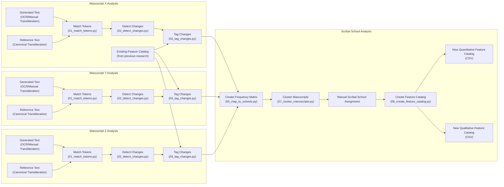

# Feature Analyzer

This project implements a modular pipeline for computational analysis of Avestan manuscripts, focusing on orthographic and phonological variation. The workflow begins by aligning OCR-generated or manually transliterated texts with canonical references at the token level, identifying and classifying grapheme-level changes such as substitutions, insertions, and deletions. Each change is annotated with contextual information and cross-referenced against an existing feature catalog from philological research.

For each manuscript, the pipeline generates a detailed profile of linguistic features, documenting both known and novel variants. These profiles are aggregated into a frequency matrix across multiple manuscripts, enabling quantitative comparison. Manuscripts are then clustered based on their feature profiles to reveal relationships and potential scribal school affiliations. Researchers can manually assign scribal schools using these analyses and subsequently generate updated feature catalogs that summarize the typicality of each variant within each school. The approach supports both statistical and traditional philological methods, providing a reproducible and extensible framework for the study of textual transmission.

## Steps

### Manuscript Analysis Pipeline
This pipeline processes a given manuscript to detect its orthographic and phonological features, which later can be compared with other manuscripts to infer its scribal school.

1. **Match Tokens**: Given a `generated text` (e.g., by OCR or manual transliteration) and a `reference text` (e.g., a manual transliteration or a canonical transliteration of a manuscript), for each token in the generated text, finds the best matching corresponding token in the reference text. It saves the result in a CSV file with the following columns:
    - `generated`: The token from the generated text.
    - `reference`: The best matching token from the reference text.
    - `distance`: The Levenshtein distance between the generated and reference tokens.
    - `address`: The address of the token in the generated text, which is a JSON object with information like the page number, line number, and token index.

Some tokens may not have a match, in which case the `reference` column will be empty and the distance column will be `1000`.

2. **Detect Changes**: For each matched token, detects the changes that transform the `generated` token into the `reference` token. It does this by comparing the graphemes in the two tokens and identifying the insertions, deletions, and substitutions of graphemes. The result is saved in a CSV file with the same columns as the previous step, plus the following columns:
   - `changes` column: Describe all the changes in order of their occurrence in the token. Each change is represented as a string like `a inserted`, `b deleted`, or `c for d`. All the changes are grouped together in a single string, separated by commas.
   - `comment` column: Provides additional context for the changes. If the change is already documented in the feature catalog, the feature's description will be included in this field, such as `ə used for i, especially in Iranian manuscripts`. This field is mostly for manual investigation.
   - `is_documented` column: A boolean indicating whether the change is already documented in the feature catalog.

### Scribal School Analysis Pipeline
Once the Manuscript Analysis Pipeline has been completed for a few manuscripts, the next step is to analyze the features extracted from these manuscripts to infer their scribal schools.

1. **Create the Frequency Matrix**: Given the result of the manuscript analysis pipeline for a set of manuscripts, creates a frequency matrix with rows representing manuscripts and columns representing all the detected changes (documented or not). Each cell contains the frequency of that change in that manuscript. The result is saved in a CSV file.

2. **Create Similarity Matrix**: Using the frequency matrix, calculates the similarity between each pair of manuscripts based on their feature profiles. The result is saved in a CSV file with rows and columns representing manuscripts and cells containing the similarity score between them.

3. **Visualize Similarity Matrix**: The similarity matrix is visualized in the following ways to help researchers understand the relationships between manuscripts:
    - Hierarchical Tree: A dendrogram is created to represent the hierarchical clustering of manuscripts based on their similarity scores. This tree shows how manuscripts are related to each other.
   - Cluster Map: A clustermap, which is the combination of a heatmap and a hierarchical clustering dendrogram, is created to show the similarity between manuscripts.

Both visualizations are saved as image files in the output directory.

4. **Scribal School Assignment**: This is a manual step. In this step, the researcher judges the scribal school of each manuscript based on the dendrogram, the similarity matrix/heatmap, and the frequency matrix. This step creates a CSV file with two columns:
    - `manuscript`: the manuscript name or identifier.
    - `scribal_school`: The assigned scribal school for that manuscript.

5. **Propose a new Feature Catalog**: Based on the Scribal School assignment, a feature catalog for each scribal school is created. This catalog describes the typicality of each feature across known scribal schools (e.g., Yazdi, Kermani, Bombay). It is saved in a CSV file with rows representing features and columns representing scribal schools. For ease of use, the result is saved in two formats:
    - `Quantitative`: Each cell contains the percentage of total occurrences of that feature in the manuscripts in that school over the total occurrences of all features in that school. 
    - `Qualitative`: Each cell contains a short description of the feature in that school, such as "frequent", "rare", or "absent".

7. **Scribal School Prediction"**: Given the feature profile of a manuscript and the proposed feature catalog, predicts the scribal school of the manuscript by evaluating the similarity of its feature profile with the feature profiles of known scribal schools. The result is saved in a CSV file with rows representing manuscripts and columns representing scribal schools. Each cell contains the similarity score between the manuscript and the corresponding scribal school.

## Project Structure
Each step of the pipeline is implemented as a separate Python script, which can be run independently or as part of a larger workflow. The names of the scripts correspond to the steps described above, with a prefix `01_`, `02_`, etc., indicating the order of execution. Each step can be implemented in different ways (e.g., using different libraries or algorithms), but the input and output formats are standardized to ensure compatibility. The algorithm or variant name is included in the script name for clarity. For example, `01_match_tokens-dictionary.py` indicates that this script implements the token matching step using a dictionary-based approach.
